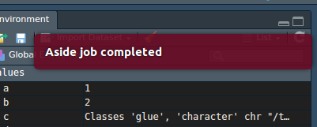

---
output:
  md_document:
    variant: markdown_github
---

<!-- README.md is generated from README.Rmd. Please edit that file -->

```{r, echo = FALSE}
knitr::opts_chunk$set(
  collapse = TRUE,
  comment = "#>",
  fig.path = "README-", 
  eval = FALSE
)
```

An RStudio addin to run long R commands aside your current session. 

This package is more of a POC for now, really to be considered as a WIP. Feel free to open issue or send pull requests! For now, this addin only works on Linux and Mac OS, but I'm working on this :) 

# aside

Have you ever been waiting in front of you R session from a command to finish? Say goodbye to wasted time with {aside}, an RStudio addin running commands aside and sending you the result in a temp file. 


## How it works 

You can simply write a function like: 

```{r}
library(aside)
aside("a <- 12")
```

And the command will be run in a new R session in the background. But the biggest strength of {aside} is that you can select the line in your script, and clic Addins > ASIDE > aside. Yes, that means you can also map it to a keyboard shortcut \\o/. 


## Aside in practice

When run, you'll get in your console the Terminal the code was sent to, and the temp file the result will be saved into. You can then just copy and paste the load() command printed in your console. 

If you save your aside call like this:

```{r}
b <- aside("a <- 12")
```

You can simply:

```{r}
load(b)
```

## How do I know the job is finished?

As stated, this package is still under dev, and so far notications is still a part I'm working on. If like me you're on Ubuntu and / or on a recent Mac OSX, the notification process should work and you'll get a message stating the job is complete.



You can also watch over the process by opening the terminal with:

```{r}
aside("a <- 12", show = TRUE)
```


## Windows users

If you're on windows, I have for the moment not implemented {aside}. Sorry ¯\\_(ツ)_/¯

If you're not happy with that, feel free to send me a [PR](https://github.com/ColinFay/aside/pulls) or to open an [issue](https://github.com/ColinFay/aside/issues). 
